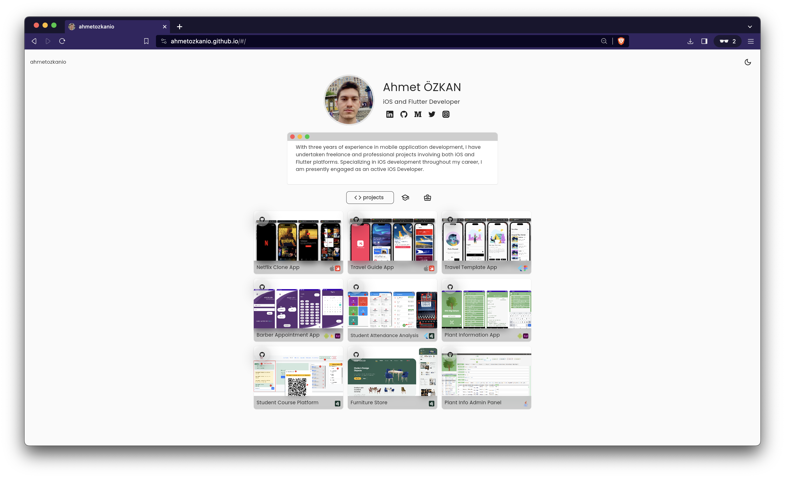
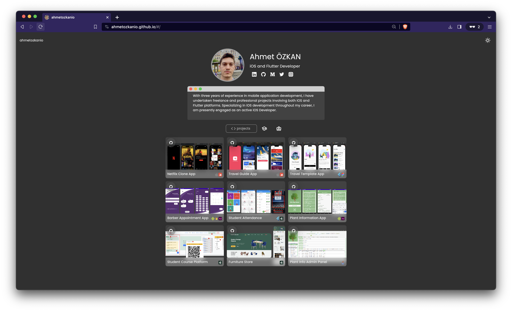
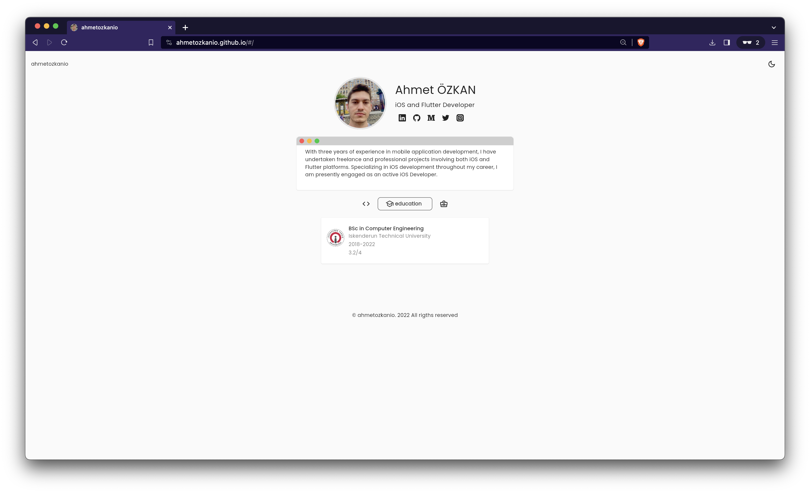
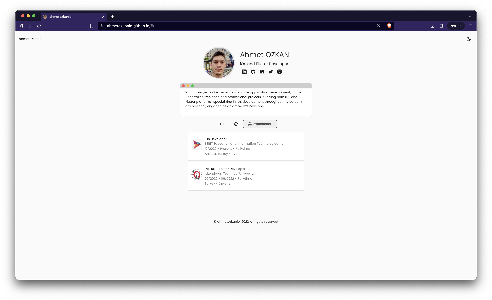
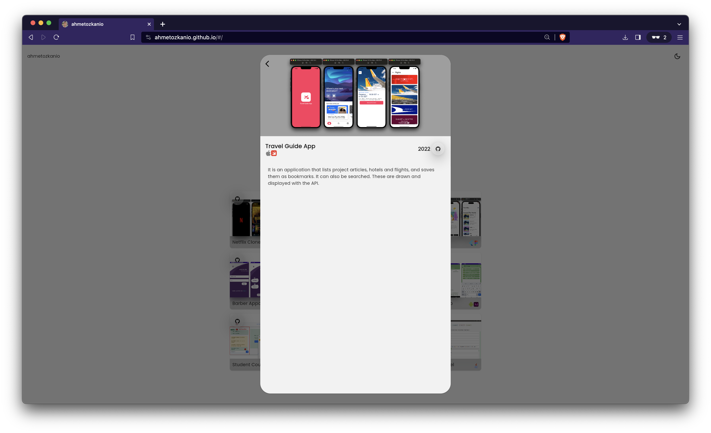
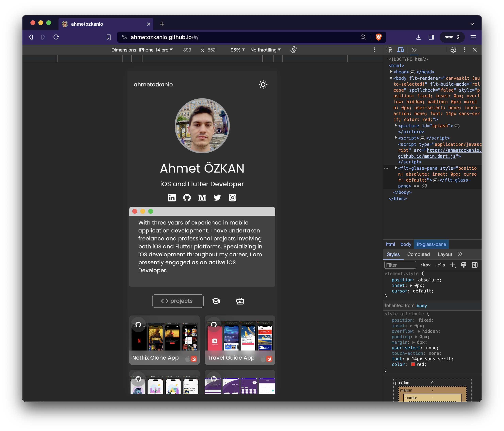
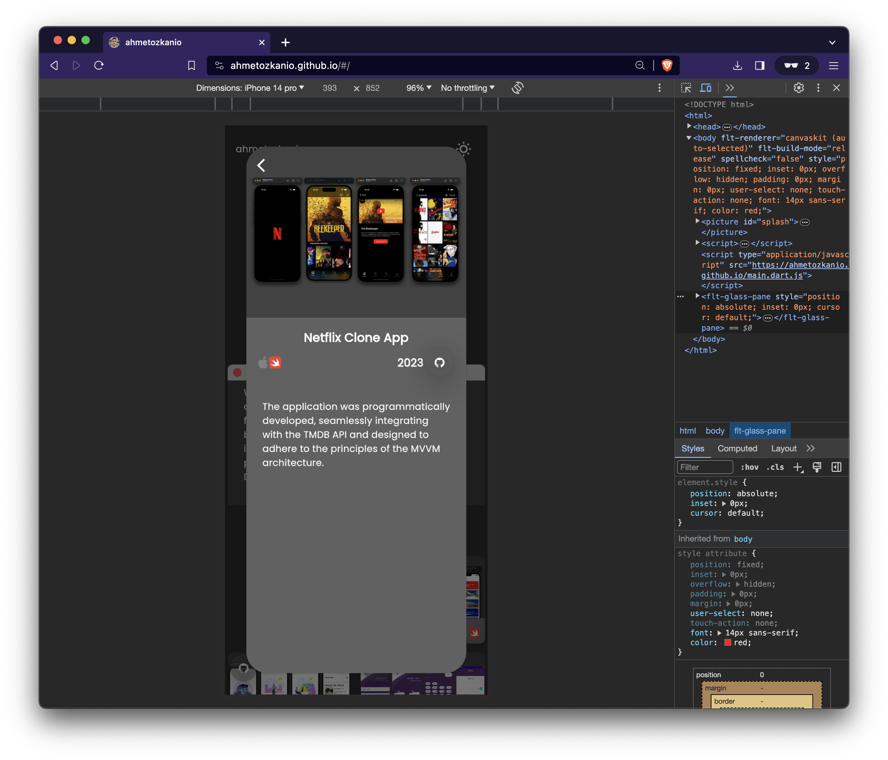

## Portfolio App Flutter - Responsive (Mobile & Web)

I made this project for my own website portfolio. All data in the project is provided via API. So, you can actually take this project yourself, update the API side and use it.

### Example API

https://github.com/ahmetozkanio/custom-api-public/tree/main/my-site

### APP Movie

### Screenshots

    
    
    
    
    
    
    
    

